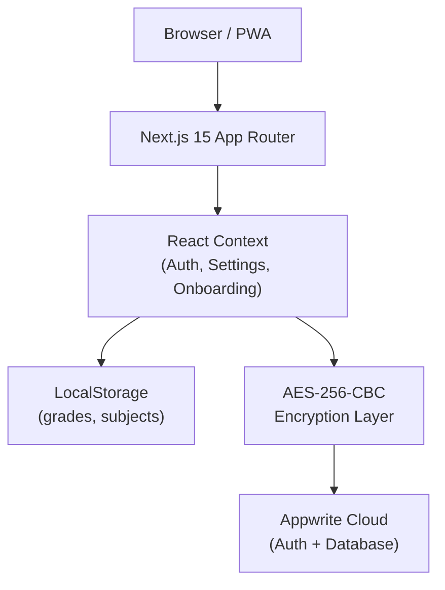
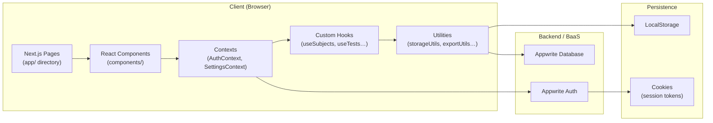
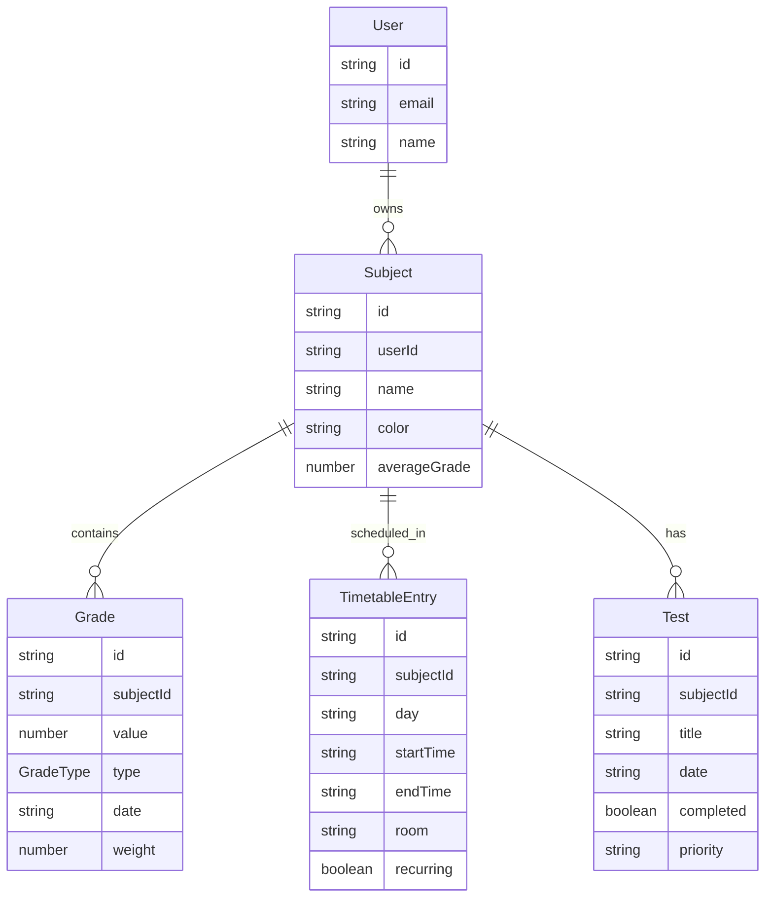
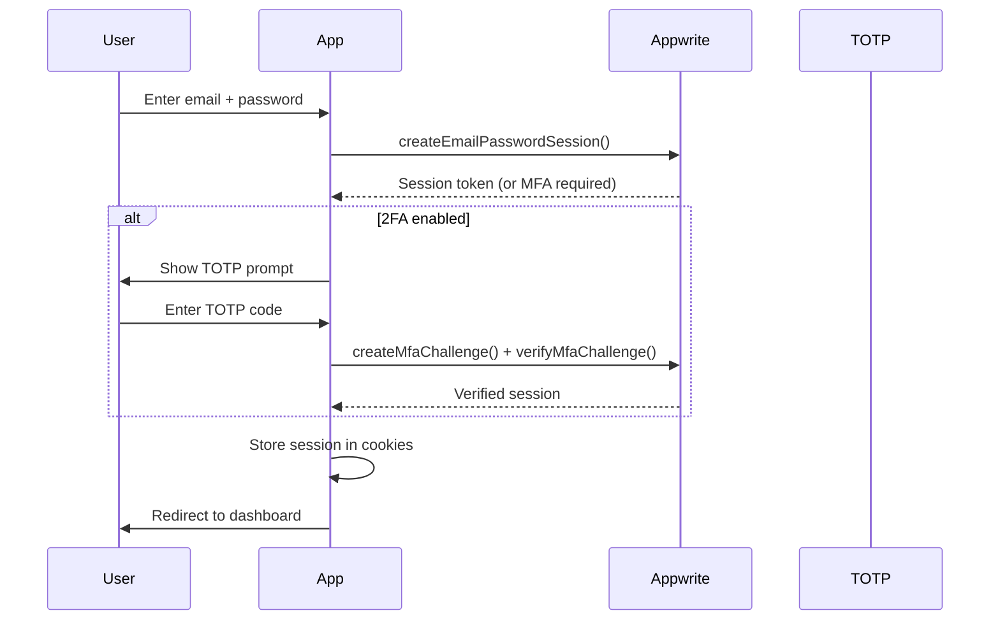
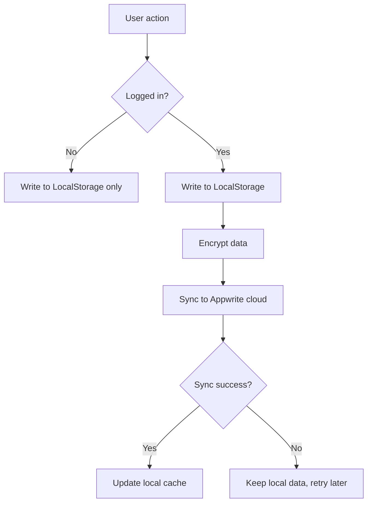

This page describes the high-level structure of Grade Tracker, how the key components relate to each other, and how data flows through the system.

## Technology Overview



## Application Layers



## Directory Structure

```
grades-tracker/
├── app/                    # Next.js App Router pages & API routes
│   ├── api/                # Server-side API routes
│   │   ├── admin/          # Admin management endpoints
│   │   ├── auth/           # MFA / 2FA challenge endpoints
│   │   └── mfa/            # MFA verification endpoints
│   ├── analytics/          # Analytics dashboard page
│   ├── subjects/           # Subject detail pages
│   ├── kanban/             # Kanban board
│   ├── academic-calendar/  # Academic calendar / timetable
│   ├── profile/            # User profile & settings
│   ├── register/ login/    # Authentication pages
│   └── layout.tsx          # Root layout (providers, theme)
│
├── components/             # Reusable React components
│   ├── ui/                 # shadcn/ui primitives (Button, Card…)
│   ├── auth/               # Login, Signup, 2FA components
│   └── *.tsx               # Feature components (GradeHistoryChart…)
│
├── contexts/               # React Context providers
│   ├── AuthContext.tsx      # Authentication state
│   ├── SettingsContext.tsx  # User preferences
│   └── OnboardingContext.tsx
│
├── hooks/                  # Custom React hooks
│   ├── useSubjects.ts      # Subject data fetching & caching
│   ├── useTests.ts         # Test/assignment management
│   └── useStudySession.ts  # Pomodoro session management
│
├── lib/                    # Core library modules
│   ├── appwrite.ts         # Appwrite client + CRUD helpers
│   └── constants.ts        # App-wide constants
│
├── utils/                  # Pure utility functions
│   ├── storageUtils.ts     # LocalStorage CRUD + cloud sync
│   ├── encryption.ts       # AES-256-CBC encrypt / decrypt
│   ├── exportUtils.ts      # CSV / PDF export
│   └── cloudSync.ts        # Cloud synchronisation logic
│
├── types/
│   └── grades.ts           # Core TypeScript interfaces
│
├── messages/               # i18n translation files (en, fr, de, es)
└── public/                 # Static assets
```

## Data Model



## Authentication Flow



## Grade Calculation

Grades use a **weighted average** system:

| Grade Type | Default Weight |
|---|---|
| Test | 2.0× |
| Oral Exam | 2.0× |
| Homework | 1.0× |
| Project | 1.0× |

The formula:

```
averageGrade = Σ(grade.value × grade.weight) / Σ(grade.weight)
```

Grade scale: **1** (best) → **6** (worst), consistent with many European grading systems.

## Data Persistence Strategy



All cloud data is encrypted client-side with AES-256-CBC before transmission. The encryption key is never sent to the server.
